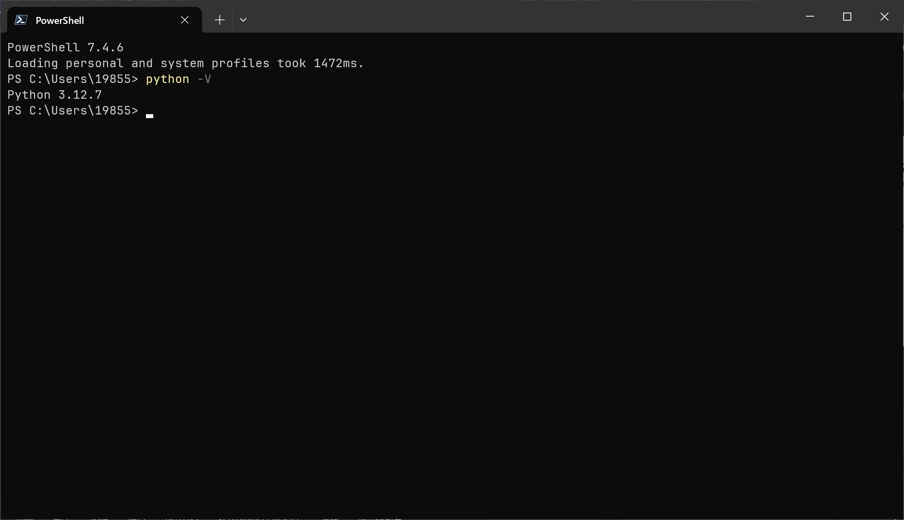
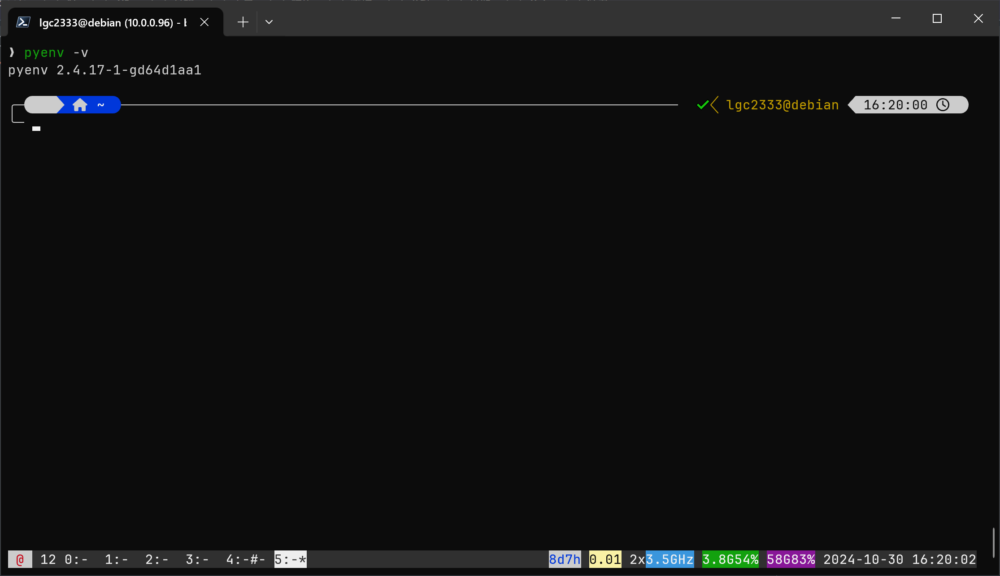
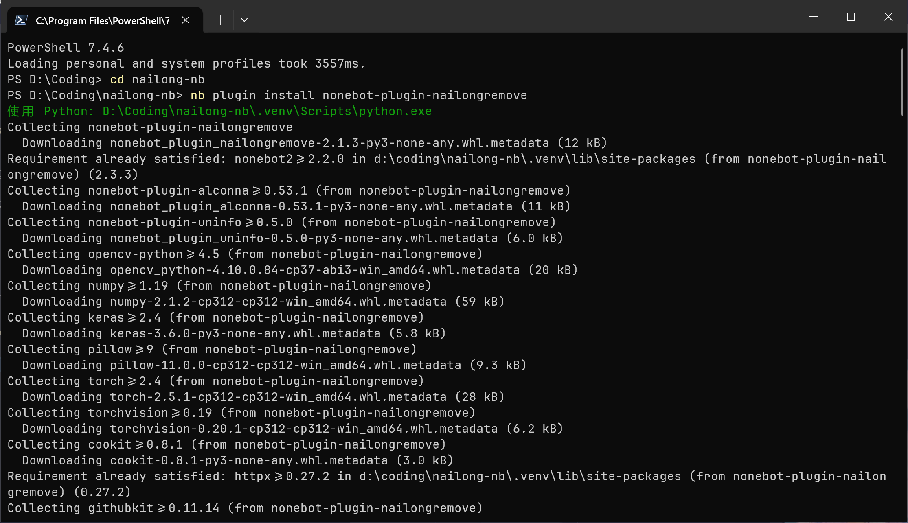
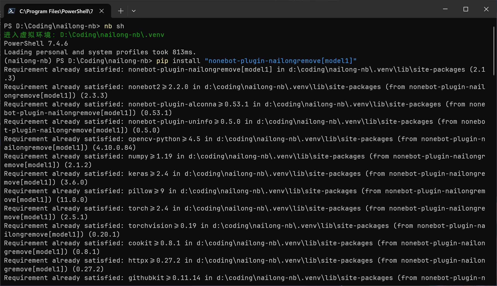
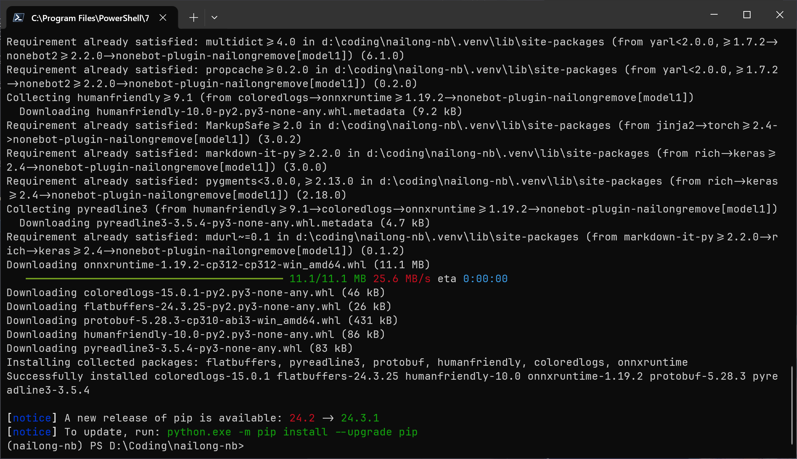
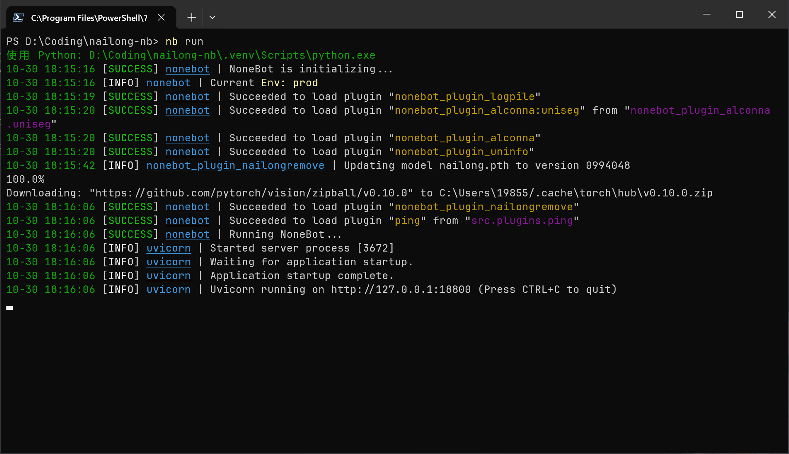

<!-- markdownlint-disable MD028 MD033 -->

# 从零开始的面向小白的插件部署教程

## 1. 部署 Python 环境

如果你已经拥有自己心仪的 Python 环境，检查你的 Python 版本是否大于等于 3.9 即可

> [!WARNING]
> 不建议下载最新的 Python 版本，因为可能有第三方库还没来得及适配最新版的 Python，导致出现插件依赖相关问题
>
> 在下面的教程中，我们会下载最新版本的前一个大版本

> [!NOTE]
> 本人不喜欢 Conda 给系统上它的默认环境，所以下面不介绍如何使用 Conda

### Windows

访问 Python 官网 <https://www.python.org>，鼠标移到 Downloads 上，之后点击 All Releases


之后向下滚动到 Looking for a specific release 下寻找要下载的版本

在上张图片中可以看到当前最新的 Python 版本为 3.13.0，所以我们寻找最新的 3.12 版本下载


点进去之后向下滚找到 Windows installer (64-bit) 下载（现在的电脑一般是 X86 架构 CPU 加 64 位操作系统，如果是其他架构请自行下载对应架构的安装包）


下载完成后打开安装包<small>（忽略这个是 3.11 版的安装界面）</small>，**一定要记得勾选 Add python.exe to PATH！！！** 然后直接点击 Install Now 安装即可

如果要更改安装路径可以选择 Customize Installation 后自行更改后继续安装，注意安装路径最好不要有中文


打开终端（Win + R 输入 `powershell` 回车），输入以下内容回车验证 Python 是否安装成功

```shell
python -V
```



### Linux

在 Linux 环境下我们使用 [pyenv](https://github.com/pyenv/pyenv) 来管理系统中的 Python

在命令行中输入以下命令回车安装：

```shell
curl https://pyenv.run | bash
```

然后执行下面的命令来向 shell 配置中写入 pyenv 的环境变量相关配置（如果你使用的不是 bash，请自行替换文件名）

```shell
echo 'export PYENV_ROOT="$HOME/.pyenv"' >> ~/.bashrc
echo '[[ -d $PYENV_ROOT/bin ]] && export PATH="$PYENV_ROOT/bin:$PATH"' >> ~/.bashrc
echo 'eval "$(pyenv init -)"' >> ~/.bashrc
```

执行以下命令重载 shell 配置（其他 shell 请自行修改文件名）

```shell
source ~/.bashrc
```

现在你应该可以使用 pyenv 了

```shell
pyenv -v
```



按照 [Wiki 中 Suggested build environment 部分](https://github.com/pyenv/pyenv/wiki#suggested-build-environment) 根据你所使用的发行版安装好所需依赖，如下面是 Ubuntu / Debian / Linux Mint 发行版所需执行的命令


装好依赖后开始安装 Python，执行下面的命令安装 Python 3.12

```shell
pyenv install 3.12
```

稍等片刻安装好后，设置 Python 3.12 为 shell 中的默认 Python

```shell
pyenv global 3.12
```

验证是否安装成功

```shell
python -V
```

<small>（忽略这里的 Python 版本为 3.11）</small>


## 2. 部署 NoneBot

在这里我们使用我开发的 [nb-cli-plugin-bootstrap](https://github.com/lgc-NB2Dev/nb-cli-plugin-bootstrap) 来创建 NoneBot2 项目

先找一个心仪的目录来放置你的 NoneBot2 项目，注意路径中最好不要存在中文

Windows 用户在资源管理器中单击地址栏后输入 `powershell` 回车即可打开命令行<small>（忽略我输入的是 pwsh）</small>，如图


首先安装 `nb-cli` 与 `nb-cli-plugin-bootstrap`，输入以下命令回车

```shell
pip install nb-cli nb-cli-plugin-bootstrap
```

安装完成后输入以下内容回车开始创建项目

```shell
nb bs
```

项目名称为创建项目后的文件夹名称

选择适配器时，使用键盘上下键将左侧箭头指向 OneBot V11 适配器（如果你要对接野生 QQ 机器人），之后 **按一下空格** 选中该适配器  
**这步一定要记得按空格选中你要安装的适配器！！！选中后左侧圆圈会变成实心，该项也会亮起，请注意区分！！**


剩余选项根据你的喜好填写即可，如果不想自定义可以一直回车使用默认设置  
建议修改一下端口号避免由于端口被占用导致 NoneBot 无法启动

部分设置后续可以通过 `.env.prod` 文件修改，使用任意文本编辑器打开查看详细信息  
之后的插件配置也需要填写到此文件中

安装完成后如图


## 3. 安装插件

接上一步操作，在命令行中输入下面的命令将工作目录切换到你创建好的项目目录中  
<small>或者在资源管理器中打开项目文件夹后单击地址栏输入 `powershell` 回车打开新的命令行窗口</small>

```shell
cd 项目名
```

之后输入下面的命令来安装本插件

```shell
nb plugin install nonebot-plugin-nailongremove
```

安装过程如图

  


如果想要使用模型 1，按照下面的操作来安装额外依赖

先进入虚拟环境，进入虚拟环境后命令行左侧应该会多出来你虚拟环境的名字

```shell
nb sh
```

再安装额外依赖

```shell
pip install "nonebot-plugin-nailongremove[model1]"
```

安装过程如图

  


## 4. 启动 NoneBot

在命令行中输入以下命令并回车启动 NoneBot

```shell
nb run
```

Windows 下也可以直接双击 `#启动.bat`  
Linux 下也可以使用 `./#run.sh`

~~**NoneBot，启动！**~~

启动完成并且没问题的话，应该像下面这样，没有任何报错


